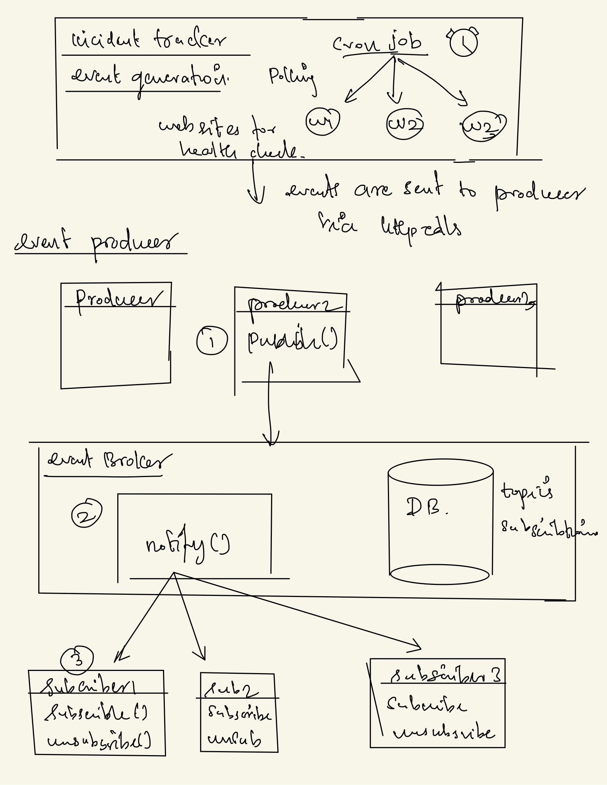
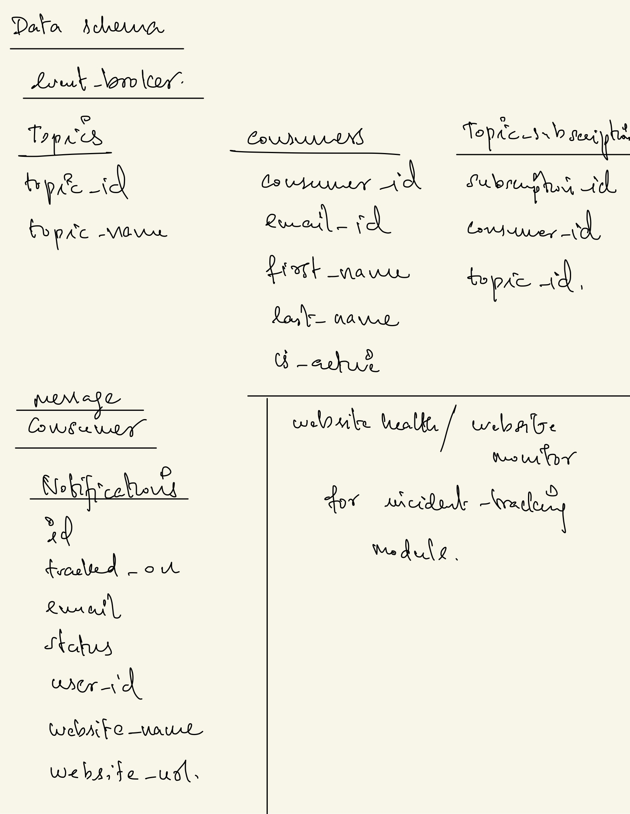
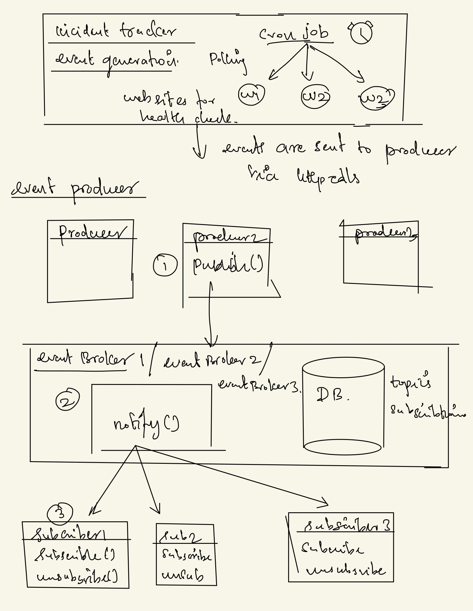

# Status.io

StatusIO is an incident tracking tool for the websites. Multiple Users can subscribe to multiple services either they will be notified via email or slack, discord channels or in the service's twitter handle. 

For the Phase I, we have simple server which accepts subcriber details that will be stored in the DB. 

## Technologies used
1. Spring Boot Web Application which runs in port 8080
2. Postgres DB which runs in the port 5432

## Prerequisites
The following items should be installed in your system:
- Git command line tool
- Maven
- Java
- Docker

# Phase I Submission
## Usage
    $ https://github.com/KaviarasuSakthivadivel/project-ds-statusio.git`
    
    $ cd project-ds-statusio

To execute the backend with Docker, first clean and package using maven commands below
    
    $ ./mvnw clean package -DskipTests

After this, use docker-compose to spin up the server.  
    
    $ docker-compose up

Then, visit

    $ http://localhost:8080

## Curl

*To get the list of subscribers*

```curl --location --request GET 'http://localhost:8080/subscriber/'```

*To create a subscriber* 
    
    curl --location --request POST 'http://localhost:8080/subscriber/' \
    --header 'Content-Type: application/json' \
    --data-raw '{
        "firstName": "Kaviarasu",
        "lastName": "Sakthivadivel",
        "email":"kascatchme@gmail.com"
    }'


# Phase 2 Submission

Since we didn't get a real-time API for website monitoring, we have created a project (incident-tracker) module in the repo 
that runs a CRON job in the background and fetches the data for the Phase II. For tracking the website health/ status, we have created CRUD operations for the same. We can add / update / delete websites for health tracking. 

All the APIs are available in the documentation below. Only for the (incident-tracker) / (event-broker) module, we are using the curl command or the equivalent command in the Postman is used. Other communications within the docker are done using the redis pub sub model. 
Link - https://documenter.getpostman.com/view/8281338/UV5agbhx

Architectural design as follows



Data Schema for the event-broker and message-consumer. We don't need to have data schema for the message producer.




## Usage
    $ https://github.com/KaviarasuSakthivadivel/project-ds-statusio.git`
    
    $ cd project-ds-statusio

To execute the backend with Docker, first clean and package using maven commands below. We need to package all the module separately. 
1. First ```service-util```. That's a utility package we need for exchanging data between the docker containers. We have used the absolute path in all the POM files to include this module. After packing this module, change the POM files accordingly, 


``<dependency>
<groupId>edu.buffalo.distributedsystems</groupId>
<artifactId>service-util</artifactId>
<version>${project.version}</version>
<scope>system</scope>
<systemPath>/Volumes/MacintoshHD/Users/kaviarasu/GitHub/status-io/service-util/target/service-util-0.0.1-SNAPSHOT.jar</systemPath> - Absolute path
</dependency>``

   
Then run the package command in all the other modules. 

    $ ./mvnw clean package -DskipTests

After this, use docker-compose to spin up the server.

    $ docker-compose up

Once the server is up, we need to create the topics and the consumers (Users). Kindly use the documentation above to create the consumers/ topics. 

Then go to, message-consumer UI, where the consumers can connect using the web sockets and receive the notification(message-events) in real time. Enter the email id and click on connect. 
    
    http://localhost:8083 


# Phase 3 Submission
## Usage
    $ https://github.com/KaviarasuSakthivadivel/project-ds-statusio.git`
    
    $ cd project-ds-statusio

Follow all the process from the phase 2. Here we can use scale-up in Docker to spin up three brokers to handle the topics. 



### Contributions
 - Incident tracker for website health tracking - Kaviarasu Sakthivadivel.
 - Message Producer and Message Consumer Implementations in both phases - Sendil Balan Palanivel
 - Event broker, we split the work for Phase 3 - Kaviarasu Sakthivadivel & Sendil Balan Palanivel

